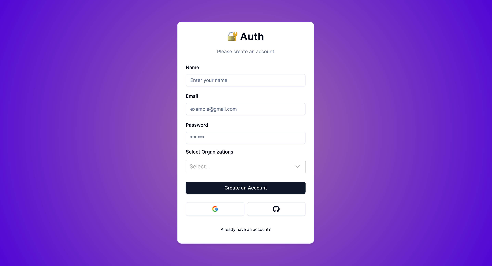
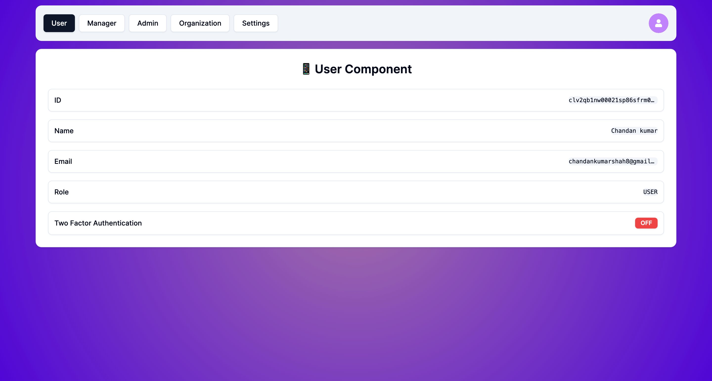
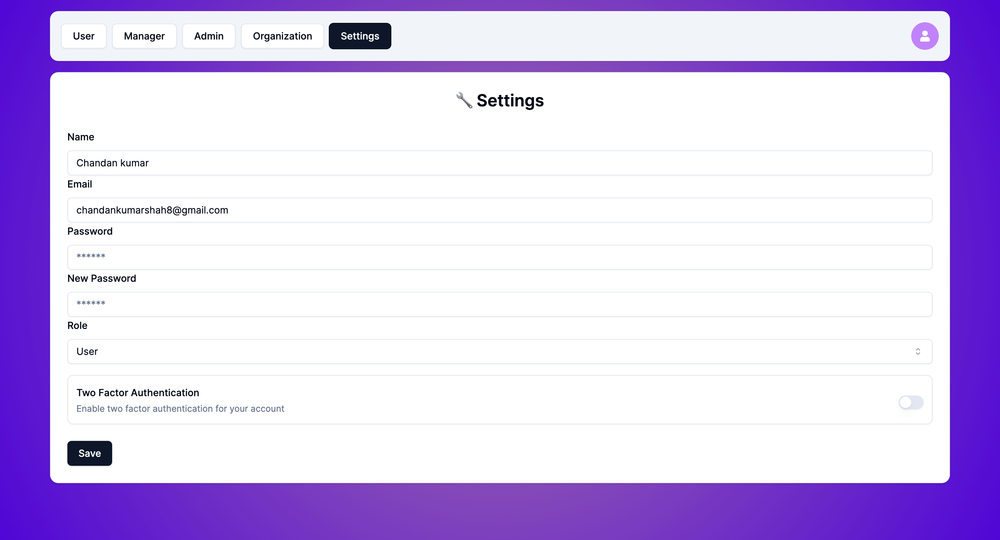

# User Management System

## Introduction

The User Management System is a comprehensive application developed as part of an assignment. It is built using **Next.js**, **NextAuth.js**, and **Prisma** and leverages **Resend** for email communication. The system provides a seamless registration process via credentials or social logins such as GitHub or Google. During the account creation process, users are required to associate themselves with at least one organization. A verification link is sent to the user's email upon account creation. Verification is completed once the user clicks on this link, enabling them to log in.



## Features

The system provides the following features:

1. **User Authentication**: User registration with email verification, login using email and password, social authentication (e.g., Google, Facebook), and user logout functionality.
2. **Tenant Management**: Users are associated with a specific "tenant" or organization. Administrators can create, edit, and delete tenants. Users can belong to one or more tenants.
3. **Role-Based Access Control (RBAC)**: Roles (e.g., admin, manager, user) with different access levels are defined. Roles can be assigned to users within a tenant.
4. **Forgot Password**: Users can request a password reset link via email. Email-based password reset functionality is implemented with secure token generation and validation for password reset.
5. **Reset Password**: Users can reset their password after clicking the reset link. A secure and user-friendly password reset process is implemented.
6. **Two Factor Authentication**: The system includes a feature for two-factor authentication, which can be enabled from the settings page after login. This provides an additional layer of security for user accounts.

## User Interface

Post login, users can navigate through five different views:

1. User
2. Manager
3. Admin
4. Organization
5. Settings



## User Roles

The system defines three distinct roles:

1. User
2. Manager
3. Admin

An **Admin** has the highest level of access, including the ability to create and modify organizations. When an organization is created, an admin must assign a user with the **Manager** role to manage the organization. A **Manager** can view all the organizations they manage and the members within those organizations. All users have the ability to modify their name, reset their password, and update their email (subject to email verification).

## Two Factor Authentication

The system also includes a feature for two-factor authentication, which can be enabled from the settings page after login. This provides an additional layer of security for user accounts.



## Live Demo

The project is already deployed and can be accessed through this [link](https://user-management-system-lime.vercel.app/).

## Local Development

To set up the project locally, follow these steps:

1. Create a `.env` file and define all the necessary environment variables:

```env
DATABASE_URL=
AUTH_SECRET=
GOOGLE_CLIENT_ID=
GOOGLE_CLIENT_SECRET=
GITHUB_CLIENT_ID=
GITHUB_CLIENT_SECRET=
RESEND_API_KEY=
NEXT_PUBLIC_API_URL=
```

2. Install the project dependencies:

```bash
npm i
```

3. Generate Prisma:

```bash
npx prisma generate
npx prisma db push
```

4. Start the development server:

```bash
npm run dev
```
